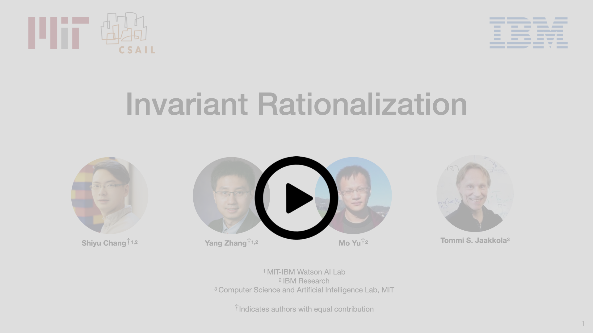

# Invariant Rationalization
This repo contains the Tensorflow implementation of [Invariant Rationalization](https://arxiv.org/abs/2003.09772) on the polluted [IMDB dataset](http://ai.stanford.edu/~amaas/data/sentiment/) (please refer to the paper for details) for the demo purpose. 

The original [beer review dataset](http://snap.stanford.edu/data/web-BeerAdvocate.html) has been removed by the dataset’s original author, at the request of the data owner, BeerAdvocate.  To respect the wishes and legal rights of the data owner, we do not include it in our repo.  We remain happy to provide assistance to generate data partition indices for the dataset, for any user who has rights to the data.

There is a short video that explains the main concepts of our work. If you find this work useful and use it in your research, please consider citing our paper.

[](https://youtu.be/C9dUcljt4WQ)


```
@article{chang2020invariant,
  title={Invariant Rationalization},
  author={Chang, Shiyu and Zhang, Yang and Yu, Mo and Jaakkola, Tommi S},
  journal={arXiv preprint arXiv:2003.09772},
  year={2020}
}
```

## Getting Started
Below is the step-by-step instruction on running our code.  After cloning the repo, please first run the following script to download the dataset and the pre-trained word embeddings.
```bash
sh download_data.sh
```
The IMDB dataset downloaded here is identical to the one in `tensorflow datasets`.  You could of course directly using the [build-in functions](https://www.tensorflow.org/datasets/catalog/imdb_reviews) in TensorFlow with some minor tweaks.  

Next, you need to properly set up your virtual environment and install all dependencies from the `requirements.txt`.  You may consider the following commend:
```bash
pip install -r requirements.txt
```

Once all packages are installed, now you are ready to have some fun by using the following commends under your main directory.
```bash
sh run_demo.sh
```

You are expected to see a similar result as the following.
```console
The best dev performance appears at epoch: 28.
The best dev performance and bias selection are: 0.8454, and 0.0000.
The corresponding test performance and bias selection are: 0.8492, and 0.0000.
```
**Tested environment:**
Python 3.6.10, Tensorflow: 1.14, CUDA driver: 410.48, CUDA version: 10.0, and Cudnn: 7.4.1.

## Final Words
That's all for now and hope this repo is useful to your research.  For any questions, please create an issue and we will get back to you as soon as possible.
